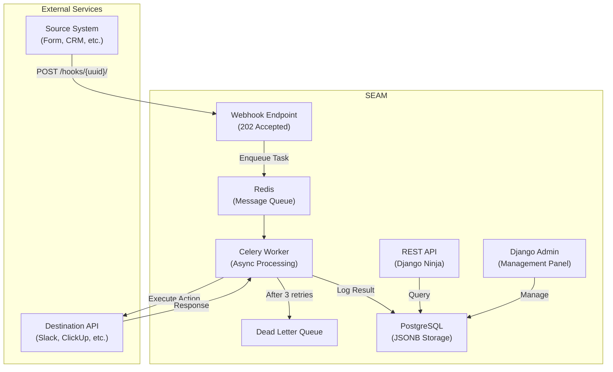

<p align="center">
  <h1 align="center">⚡ SEAM</h1>
  <p align="center">
    <strong>A multi-tenant SaaS webhook integration hub for event-driven automation</strong>
  </p>
  <p align="center">
    <a href="#-quick-start">Quick Start</a> •
    <a href="#-architecture">Architecture</a> •
    <a href="#-api-docs">API Docs</a> •
    <a href="#-what-this-demonstrates">Skills Demonstrated</a>
  </p>
</p>

<p align="center">
  
  
  
  
  
  
  
  
  
</p>

---

## 📋 Overview

**SEAM** is an open-source webhook integration platform that allows users to connect different systems through configurable **workflows**. It receives data from a source (webhook), processes it, and forwards it to a destination (external API).

Think of it as a self-hosted, developer-focused alternative to tools like Zapier — but built to demonstrate production-grade backend engineering.

> ### 💡 The Name: S.E.A.M.
> 
> **(Synchronized Event & Action Middleware)**
> 
> - **Middleware:** Represents a shift from basic CRUD operations to complex system orchestration, showcasing an advanced architectural vision.
> - **Seam:** Acts as the perfect integration point that synchronizes an event (the trigger) with its corresponding action, seamlessly stitching systems together.

### Key Features

- 🔗 **Webhook Ingestion** — Unique URLs per workflow, instant 202 Accepted responses
- ⚡ **Async Processing** — Celery workers handle all heavy lifting in the background
- 🔄 **Retry with Backoff** — Exponential backoff (2ˢ, 4ˢ, 8ˢ) with Dead Letter Queue
- 🏢 **Multi-Tenant** — Complete workspace isolation with role-based access
- 🔐 **Secure** — JWT + API Key auth, encrypted credential storage (Fernet)
- 📊 **Observability** — Full execution logs with metrics and XLSX export
- 📖 **Auto-Documented** — OpenAPI/Swagger UI powered by Django Ninja
- 🐳 **One Command Setup** — `docker compose up` and you're running

---

## 🚀 Quick Start

```bash
# 1. Clone the repository
git clone https://github.com/YOUR_USERNAME/SEAM.git
cd SEAM

# 2. Set up environment
cp .env.example .env

# 3. Start all services
docker compose up -d --build

# 4. Seed demo data (optional)
docker compose exec web python manage.py seed_demo

# 5. Open the API docs
# → http://localhost:8000/api/docs
```

**Demo credentials:** `demo@seam.dev` / `demo1234`

---

## 🏗 Architecture



### Tech Stack

| Layer | Technology | Purpose |
|-------|-----------|---------|
| **Frontend UI** | React 18 + Vite + TS | High-performance SPA dashboard |
| **Styling** | Vanilla CSS Modules | Zero-conflict scoped minimalist styling |
| **State & Data** | Zustand + React Query | State management and live API data syncing |
| **Backend API** | Django 5.x + Django Ninja | REST API with OpenAPI auto-docs |
| **Database** | PostgreSQL 16 | JSONB for dynamic payloads |
| **Queue** | Celery + Redis | Async webhook processing |
| **Auth** | JWT + API Keys | Dual authentication support |
| **Security** | Fernet (cryptography) | Credential encryption at rest |
| **Infrastructure** | Docker + docker-compose | One-command deployment |
| **CI/CD** | GitHub Actions | Lint, test, build pipeline |

### Project Structure

```
SEAM/
├── docker-compose.yml          # Services (web, db, redis, worker, beat)
├── Dockerfile                  # API Multi-stage build
├── pyproject.toml              # Python dependencies + tool config
├── frontend/                   # React Frontend App (Vite + TS)
│   ├── src/
│   │   ├── layouts/            # Auth & Dashboard shells
│   │   ├── pages/              # Workflows, Metrics, Settings
│   │   ├── components/         # Radix UI + Recharts modules
│   │   └── store/              # Zustand global state
├── src/                        # Django Backend App
│   ├── config/                 # Django settings, Celery, API URLs
│   ├── apps/
│   │   ├── accounts/           # User, JWT Auth, API Keys
│   │   ├── workspaces/         # Multi-tenant workspaces
│   │   ├── workflows/          # Triggers, Actions, Workflow Pipeline
│   │   ├── engine/             # Celery tasks, template renderer
│   │   └── observability/      # Execution logs, metrics, export
│   └── common/                 # Middleware, mixins, encryption
└── tests/                      # backend pytest suite
```

---

## 📖 API Docs

Once running, access the interactive API documentation:

| URL | Description |
|-----|-------------|
| `http://localhost:8000/api/docs` | Swagger UI |
| `http://localhost:8000/admin/` | Django Admin Panel |

### Core API Endpoints

| Method | Endpoint | Description |
|--------|----------|-------------|
| `POST` | `/api/auth/register` | Register new user |
| `POST` | `/api/auth/login` | Get JWT tokens |
| `POST` | `/api/workspaces/` | Create workspace |
| `POST` | `/api/workflows/` | Create workflow |
| `POST` | `/api/workflows/{id}/actions` | Add action to workflow |
| `POST` | `/hooks/{webhook_path}/` | **Webhook ingestion (public)** |
| `GET` | `/api/logs/` | List execution logs |
| `GET` | `/api/logs/metrics/summary` | Aggregated metrics |
| `GET` | `/api/logs/export/xlsx` | Export to spreadsheet |

---

## 🧠 What This Project Demonstrates

This project was designed to showcase **senior-level backend engineering skills**:

| Skill Area | Implementation |
|-----------|---------------|
| **Architecture** | Clean modular structure, domain-driven app separation |
| **Async Processing** | Celery workers, Redis queue, background task orchestration |
| **Resilience** | Exponential backoff retries, Dead Letter Queue, timeout handling |
| **Multi-Tenancy** | Workspace isolation via middleware + ORM-level filtering |
| **Security** | JWT/API Key auth, Fernet encryption, non-root Docker user |
| **Data Modeling** | PostgreSQL JSONB fields, UUID PKs, proper indexing |
| **DevOps** | Docker multi-stage build, docker-compose, GitHub Actions CI/CD |
| **API Design** | RESTful, versioned, auto-documented (OpenAPI/Swagger) |
| **Code Quality** | Type hints, ruff linting, mypy, pytest, structured logging |
| **DX (Developer Experience)** | Makefile shortcuts, seed data, one-command setup |

---

## 🛠 Development

```bash
# Use Makefile shortcuts
make up              # Start all services
make down            # Stop all services
make test            # Run tests with coverage
make lint            # Run linter
make shell           # Django shell
make seed            # Seed demo data
make logs            # Follow logs
make help            # Show all commands
```

---

## 📄 License

This project is licensed under the MIT License — see the [LICENSE](LICENSE) file for details.

---

## 🤝 Contributing

Contributions are welcome! Please see [CONTRIBUTING.md](CONTRIBUTING.md) for guidelines.
