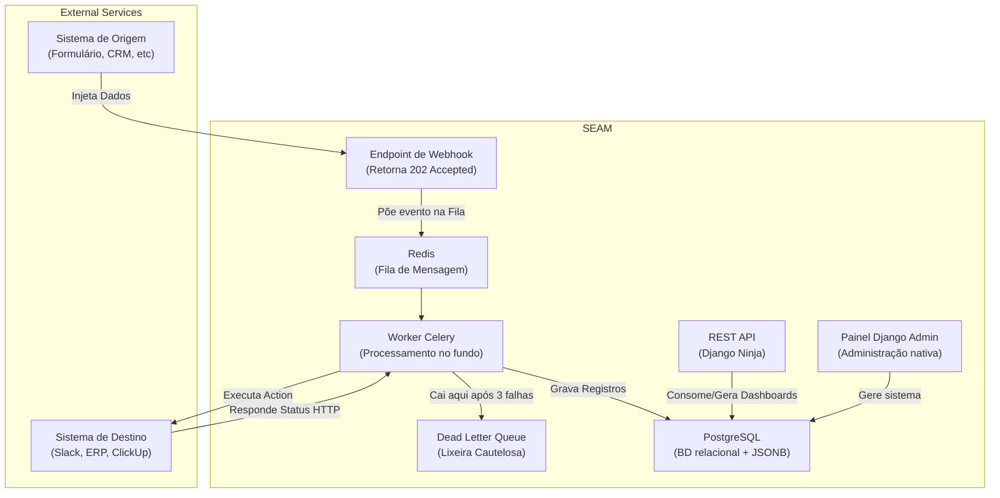

<p align="center">
  <h1 align="center">⚡ SEAM</h1>
  <p align="center">
    <strong>Hub de integração SaaS multi-tenant de webhooks para automação guiada a eventos</strong>
  </p>
  <p align="center">
    <a href="README.md">🇺🇸 English</a> • <strong>🇧🇷 Português</strong>
  </p>
  <p align="center">
    <a href="#-início-rápido">Início Rápido</a> •
    <a href="#-arquitetura">Arquitetura</a> •
    <a href="#-docs-da-api">Docs da API</a> •
    <a href="#-habilidades-demonstradas">O que o projeto demonstra</a>
  </p>
</p>

<p align="center">
  
  
  
  
  
  
  
  
  
</p>

---

## 📋 Visão Geral

O **SEAM** é uma plataforma open-source de integração de webhooks que permite aos usuários conectarem diferentes sistemas através de **workflows** configuráveis. Ele recebe dados de uma origem (webhook), os processa, e envia para um destino (API externa).

Pense nele como uma alternativa "self-hosted" (para você hospedar na própria infraestrutura) focada em desenvolvedores, parecida com o Zapier ou o Make — mas construído explicitamente para demonstrar conhecimentos em engenharia backend corporativa (production-grade).

> ### 💡 O Nome: S.E.A.M.
> 
> **(Synchronized Event & Action Middleware)**
> 
> - **Middleware:** Representa a transição de um sistema simples (CRUD básico) para um orquestrador de eventos complexos, exibindo uma visão técnica avançada.
> - **Seam (Costura/Emenda):** Atua como o ponto de integração ideal que sincroniza um evento (o gatilho) com sua respectiva ação (action), "costurando" sistemas distintos perfeitamente.

### Principais Funcionalidades

- 🔗 **Recepção de Webhooks** — URLs únicas geradas por workflow com respostas 202 imediatas.
- ⚡ **Processamento Assíncrono** — Celery workers cuidam de todo o processamento "pesado" em background.
- 🔄 **Retentativas e Backoff** — Backoff exponencial automático (2s, 4s, 8s) auxiliado por uma "Dead Letter Queue" para monitorar falhas finais.
- 🏢 **Multi-Tenant** — Isolamento de base de dados através de workspaces (um negócio não enxerga o outro) com níveis de acesso (RBAC).
- 🔐 **Segurança** — Autenticação híbrida de tokens JWT e chaves de API. Armazenamento com criptografia em disco (Fernet) de credenciais de clientes.
- 📊 **Monitoramento (Painel)** — Logs estruturados de todas as execuções, relatórios e exportações em XLSX.
- 📖 **Documentação Automática** — Integração "out of the box" com OpenAPI e Swagger nativo via Django Ninja.
- 🐳 **Instalação com "Zero Esforço"** — Execute um simples comando `docker compose up` e pronto.

---

## 🚀 Início Rápido

```bash
# 1. Clone o repositório
git clone https://github.com/SEU_USUARIO/SEAM.git
cd SEAM

# 2. Configure o ambiente
cp .env.example .env

# 3. Suba todos os serviços
docker compose up -d --build

# 4. Coloque dados fakes para testar (opcional)
docker compose exec web python manage.py seed_demo

# 5. Abra a documentação da API em sua máquina
# → http://localhost:8000/api/docs
```

**Credenciais padrão do demo:** `demo@seam.dev` / `demo1234`

---

## 🏗 Arquitetura



### Stack de Tecnologias

| Camada | Tecnologia | Objetivo |
|-------|-----------|---------|
| **Dashboard (UI)** | React 18 + Vite + TS | Painel rápido de navegação em tela única SPA |
| **Padrões Visuais**| Vanilla CSS Modules | Modulação sem atrito ou colisão global de estilos |
| **Gerenciamento**  | Zustand + React Query | Ciclo de vida robusto, cache e controle dos endpoints |
| **Motor da API**   | Django 5.x + Django Ninja | Entrega ágil de rotas REST, e automação nativa OpenAPI |
| **Banco de Dados** | PostgreSQL 16 | Flexibilidade para os campos JSONB não unificados |
| **Task Queue**     | Celery + Redis | Previne engarrafamento da tráfego web assíncrono |
| **Autenticador**   | JWT + API Keys | Flexível para Frontend vs Comunicação Máquina>Máquina |
| **Infraestrutura** | Docker + docker-compose| Orquestração rápida garantindo mesmo sistema em todo lugar |

---

## 📖 Docs da API

Após inicializado o ambiente, você pode acessar:

| URL Local | Funcionalidade |
|-----|-------------|
| `http://localhost:8000/api/docs` | Contrato técnico e testes lógicos via (Swagger) |
| `http://localhost:8000/admin/`   | Interface global e crua que controla todo o banco de dados |

---

## 🧠 Habilidades Demonstradas

Este projeto foi intencionalmente arquitetado para provar e exibir expertise como **Engenheiro Backend / Full Stack de nível Sênior**:

| Conhecimentos  | Aplicação Comprovada |
|-----------|---------------|
| **Arquitetura** | Desacoplamento de apps, estrutura enxuta com foco absoluto em padrões modulares em DRF/Ninja. |
| **Filas e Workers** | Domínio do fluxo background. O web server do projeto não fica aguardando processar, retornando latência mínima, garantindo escala elástica através do Celery. |
| **Resiliência** | Padrões de engenharia resiliente (Retry Patterns, Backoff, e captura para fila DLQ). |
| **Multi-Tenancy** | Construção com alto isolacionismo de bases, impossibilitando com filtros hardcoded o vazamento de dados confidenciais entre corporações através do uso contínuo de models e middleware injetáveis via request customizado. |
| **SecOps Básico** | Senhas das API não armazenadas em cleartext, utilizou-se o pacote symmnetric Fernet nativo pra segurança máxima num BD relacional em plain. |

---

## 🛠 Desenvolvimento Rápido

O projeto incorpora atalhos utilitários voltados para o conforto no dia-a-dia da equipe (DX - Developer Experience):

```bash
# Utilize comandos Make nativos (não é preciso gravar comandos longos)
make up              # Ativa containers em background
make down            # Desliga containers
make test            # Roda as centenas de rotinas do Pytest (Unit/Integração) cobrindo tudo via Docker nativo
make lint            # Varre o código achando deslizes lógicos (utiliza o hiperrápido Ruff)
make shell           # Adentra o terminal Django do app (com ambiente iPython)
make seed            # Enche o BD local com milhares de infos mockadas e workflows irreais caso precise rodar no Frontend sem quebrar a cabeça
```

---

## 📄 Licença

O projeto está disponível nos termos da licença (MIT) aberta. Veja o arquivo para mais.
